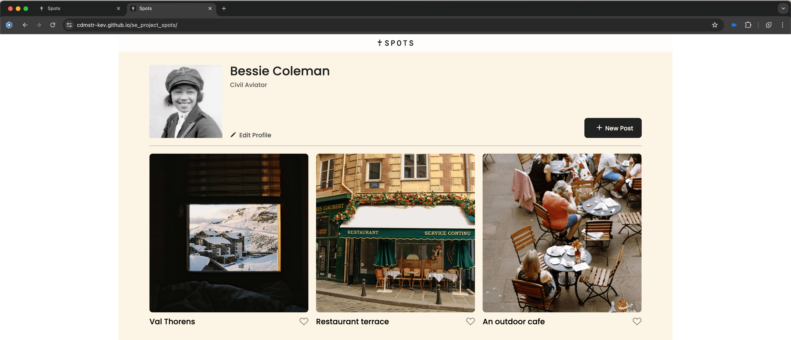
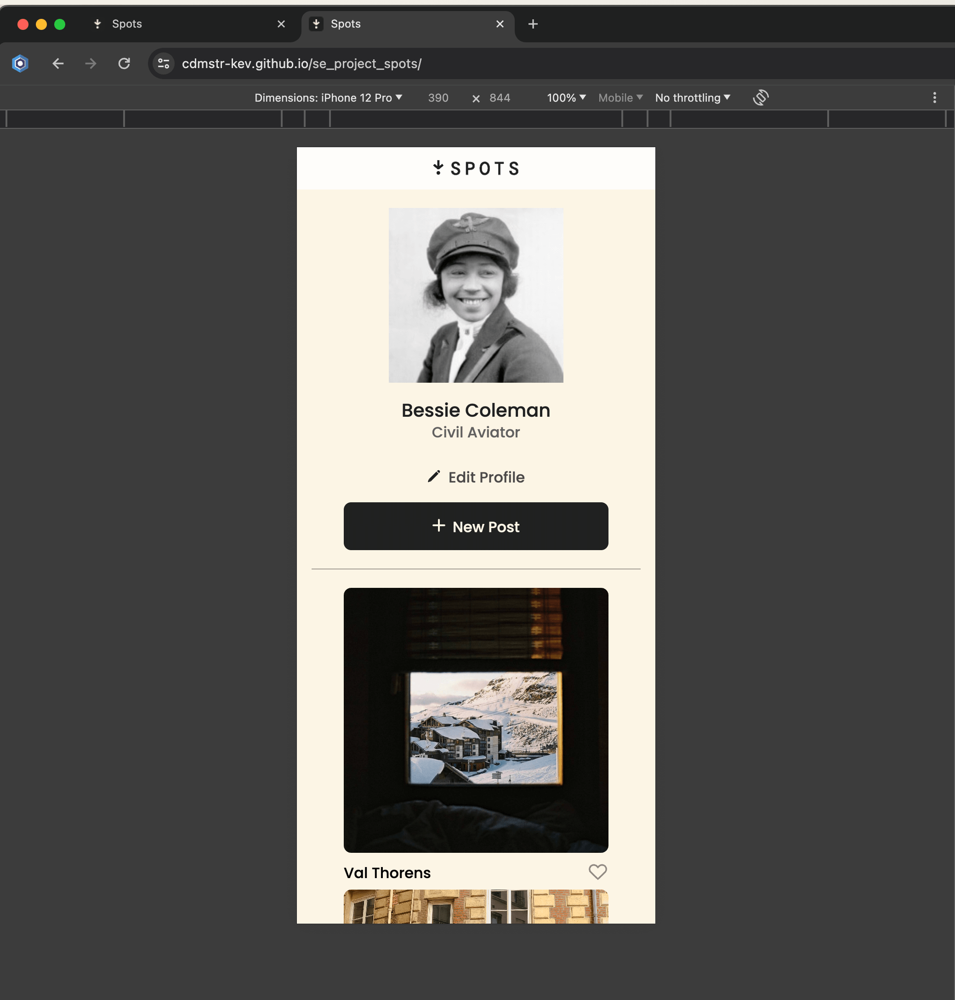
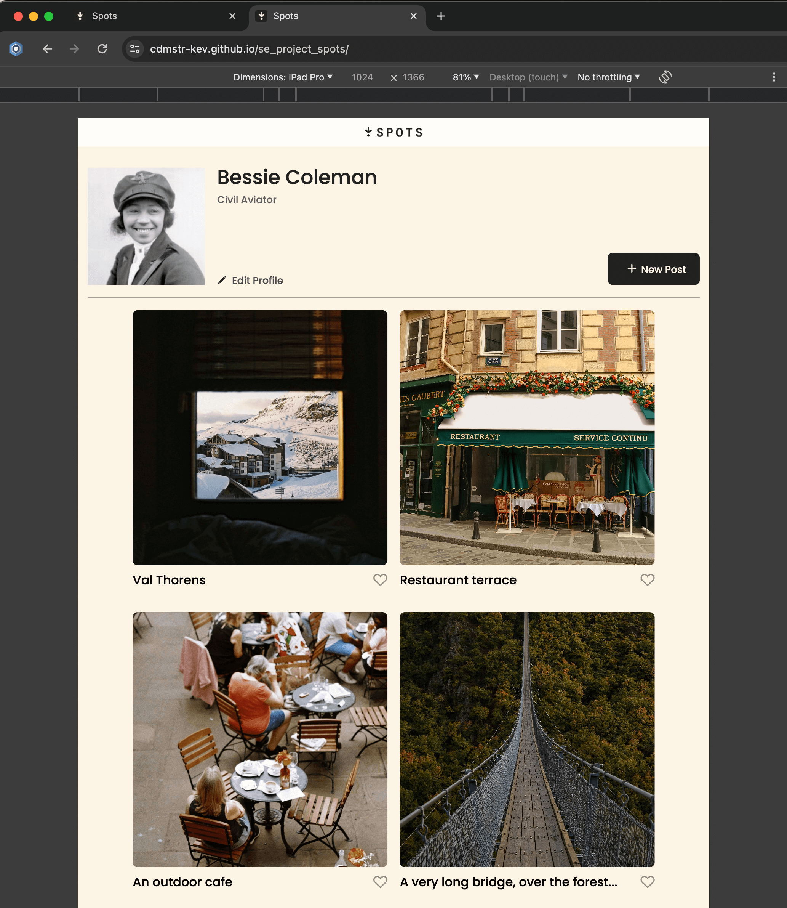

# Project 3: Spots

### Overview

- Intro
- Figma
- Images

## Project Description

The web application **Spots** provides users with a responsive photo gallery system to explore visually interesting locations and moments. The application contains a user profile area alongside a gallery showing photo cards which include descriptive titles and interactive like buttons. The application maintains a clean modern design which provides a smooth user experience across various devices.

## Functionality

**User Profile:**

The user interface shows their profile picture together with their username and bio information while providing tools to modify their profile and create new content.

**Photo Gallery:**

A dynamic grid of photo cards, each showcasing a unique spot with an image,description, and a like (heart) button for user interaction.

**Responsive Design:**

The layout adapts to different screen sizes, ensuring usability on both desktop and mobile devices.

**Accessible UI:**

The website uses semantic HTML together with descriptive `alt` text to enhance accessibility for users of all abilities.

## Technologies and Techniques Used

**HTML5:**

Semantic markup for structure and accessibility.

**CSS3:**

The application uses custom styles through CSS3 to achieve layout and responsiveness and interactivity by implementing Flexbox and Grid for modern layouts.

**BEM Methodology:**

The Block-Element-Modifier naming system enables developers to create CSS that is both maintainable and scalable.

**Responsive Design:**

The website uses media queries together with flexible units to maintain its excellent appearance across all devices.

**SVG Icons:**

The application uses crisp scalable icons for its buttons and branding elements.

**Git & GitHub Pages:**

Version control and deployment for easy collaboration and live previews.

**Figma**

- [Link to the project on Figma](https://www.figma.com/file/BBNm2bC3lj8QQMHlnqRsga/Sprint-3-Project-%E2%80%94-Spots?type=design&node-id=2%3A60&mode=design&t=afgNFybdorZO6cQo-1)

## Github Pages Link

- https://cdmstr-kev.github.io/se_project_spots/

## Screenshots

